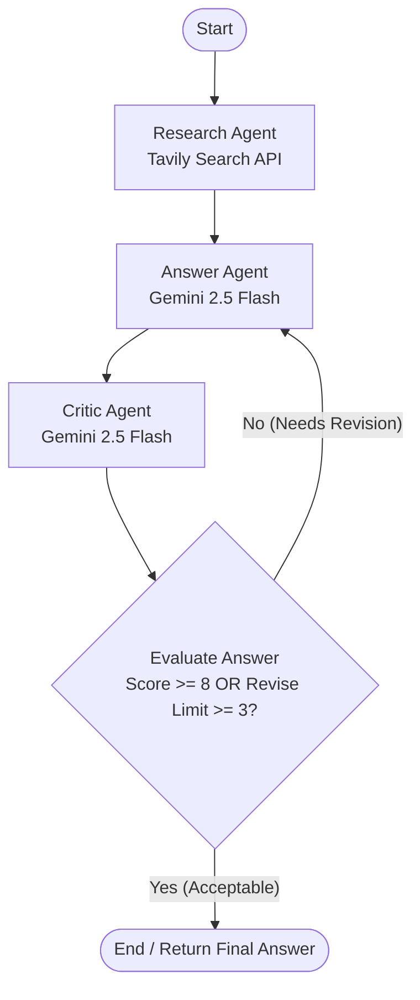

# 🎓 Agentic AI Research Assistant

An intermediate-level, industry-standard **Agentic AI Research Assistant** project built using **Python, LangChain, LangGraph, Tavily Search, Google Gemini API**, and **Streamlit**.

This repository showcases a complete multi-agent workflow implementing **sequential orchestration, conditional routing, shared state memory, and an iterative self-correction loop** (Answer Agent $\leftrightarrow$ Critic Agent). It serves as a strong resume builder for developers transitionining from basic LLM prompt chaining to professional Agentic AI architecture.

---

## 🏗️ Architecture & Workflow

The core state machine is managed by **LangGraph**. The shared `AgentState` passes parameters between three specialized agents:



### The Three-Agent Collaborative Pipeline
1. **Research Agent**: Analyzes user input, generates three targeted search queries, pulls real-time information via Tavily Search, deduplicates URLs, and extracts structured, fact-only "Research Notes".
2. **Answer Agent**: Synthesizes structured notes into a highly professional technical report. It acts in two modes:
   - **Generation Mode**: Compiles the first comprehensive draft.
   - **Revision Mode**: Modifies and enhances the report according to specific feedback received from the Critic.
3. **Critic Agent**: Audits the draft report against the raw research notes using **Gemini Pydantic structured output** (`with_structured_output`). It scores the report (1–10) and writes constructive, actionable feedback. If the score is $< 8$, the graph loops back to the Answer Agent.

---

## 📁 Folder Structure

```
project/
├── agents/
│   ├── __init__.py
│   ├── research_agent.py   # Analyzes input, queries Tavily, extracts notes
│   ├── answer_agent.py     # Drafts and revises structured reports
│   └── critic_agent.py     # Evaluates reports using structured output
├── graph/
│   ├── __init__.py
│   └── workflow.py         # Constructs and compiles the LangGraph StateGraph
├── tools/
│   ├── __init__.py
│   └── tavily_tool.py      # Official client wrapper for Tavily Search API
├── prompts/
│   ├── __init__.py
│   ├── research_prompt.py  # Prompt templates for queries and note extraction
│   ├── answer_prompt.py    # Prompt templates for report drafting and revisions
│   └── critic_prompt.py    # System prompts and Pydantic schema for Critic
├── state/
│   ├── __init__.py
│   └── graph_state.py      # State representation using TypedDict
├── ui/
│   └── app.py              # Visual, interactive Streamlit frontend
├── utils/
│   ├── __init__.py
│   └── helpers.py          # Logging, env validation, and console output formatting
├── .env                    # Environment keys (contains GEMINI_API_KEY, TAVILY_API_KEY)
├── requirements.txt        # Package dependencies
├── README.md               # Current file
├── main.py                 # CLI interface for terminal runs
└── server.py               # Exposes the LangGraph pipeline via a FastAPI REST API

```

---

## 🔌 API & Setup Guide

### Prerequisites
- Python 3.9 to 3.11 installed.
- A Google Gemini API Key (obtain from [Google AI Studio](https://aistudio.google.com/)).
- A Tavily Search API Key (obtain from [Tavily AI](https://tavily.com/)).

### Installation
1. **Clone the repository** (or copy these files into a workspace directory).
2. **Install dependencies**:
   ```bash
   pip install -r requirements.txt
   ```
3. **Configure Environment Variables**:
   - Create a file named `.env` in the root of the project.
   - Add your API keys:
     ```env
     GEMINI_API_KEY="AIzaSy..."
     TAVILY_API_KEY="tvly-..."
     ```

---

## 🚀 Execution Instructions

You can run the Agentic Research Assistant in three modes:

### 1. Terminal CLI Mode
Execute research directly inside your shell to see clean, logged state transitions as the agents communicate:
```bash
python main.py --topic "Quantum Computing" --question "What is Google's Sycamore processor and how many qubits did it use in 2019?"
```

### 2. FastAPI Backend Service Mode
Launch the FastAPI REST server:
```bash
python server.py
# Or launch directly using uvicorn:
uvicorn server:app --reload --port 8000
```
- Open `http://127.0.0.1:8000/docs` in your browser to access the interactive Swagger UI.
- You can execute HTTP POST queries directly to the `/research` endpoint using tools like Postman, curl, or our Streamlit frontend.

### 3. Streamlit Interactive Dashboard
Launch the interactive frontend user interface:
```bash
streamlit run ui/app.py
```
- Open `http://localhost:8501` in your browser.
- **Workflow Engine Selection**: In the sidebar, choose whether to run the state graph directly in-process (`Direct (Local)`) or decouple execution by sending HTTP requests to the active FastAPI backend (`API Service (FastAPI Backend)`).
- View, interact with, and export final markdown reports, research notes, and evaluation history logs.


---

## 📈 Learning Outcomes
By building this project, you will master:
1. **Shared State Memory**: How to declare, read, and write to a TypedDict structure shared across multiple isolated LLM runs.
2. **Conditional Orchestration**: Building loops and routing decisions inside a state machine using LangGraph's conditional edges.
3. **Structured Tool Use**: Orchestrating real-time web searches and programmatically extracting structured lists of URLs.
4. **Self-Correction & Refinement Loops**: The industry design pattern where an autonomous Critic evaluates, scores, and feeds back draft answers into a regeneration node.
5. **Structured JSON Parsing**: Forcing LLMs to strictly adhere to validation boundaries using Pydantic models with `llm.with_structured_output()`.

---

## 🔮 Future Enhancements
- **Multi-Query Parallelism**: Executing Tavily searches asynchronously to decrease pipeline execution times.
- **Human-in-the-loop (HITL)**: Adding an option in LangGraph where the user can inspect the critic score and override the routing decision.
- **Local PDF Export**: Automatically compiling the markdown report into a structured PDF document.
