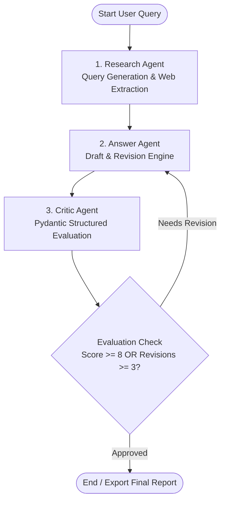

# Agentic AI Research Assistant

An autonomous multi-agent research synthesis engine built with **Python**, **LangChain**, **LangGraph**, **Tavily Search**, **DuckDuckGo**, **Google Gemini**, and **Streamlit**.

The system automates technical research by orchestrating three specialized LLM agents in a state machine. It plans search strategies, extracts deduplicated facts from real-time web results, drafts structured technical reports, and audits its own work through an automated Critic evaluation loop.

---

## 💡 Why I Built This

Standard LLM prompting for technical research often leads to superficial answers, unverified claims, or outdated information. Single-prompt generation lacks a mechanism for self-correction or fact-checking against live sources.

I designed this project to implement an **autonomous self-correction feedback loop** using **LangGraph**:
1. **Fact-First Research**: Separating raw data extraction from report drafting to prevent hallucination.
2. **Automated Peer Review**: Having a Critic Agent audit drafts against collected facts using structured Pydantic schemas before finalizing.
3. **Resilient Search Pipeline**: Building a primary search integration with Tavily and a fallback to DuckDuckGo to prevent workflow interruptions.
4. **Flexible Runtime Infrastructure**: Providing both an in-process execution engine and a decoupled REST API service backend via FastAPI.

---

## 🏗️ System Architecture & Workflow

The core workflow is governed by a compiled LangGraph `StateGraph` using a shared `AgentState` dictionary structure.


```mermaid
graph TD
    START([Start User Query]) --> ResearchAgent[1. Research Agent<br/>Query Generation & Web Extraction]
    ResearchAgent --> AnswerAgent[2. Answer Agent<br/>Draft & Revision Engine]
    AnswerAgent --> CriticAgent[3. Critic Agent<br/>Pydantic Structured Evaluation]
    CriticAgent --> Condition{Evaluation Check<br/>Score >= 8 OR Revisions >= 3?}
    Condition -- Approved --> END([End / Export Final Report])
    Condition -- Needs Revision --> AnswerAgent
```

### The Multi-Agent Pipeline

1. **Research Agent** (`agents/research_agent.py`):
   - Generates 3 targeted, non-overlapping search queries based on the user prompt.
   - Queries the web via Tavily Advanced Search. If Tavily fails or returns empty results, it automatically fails over to DuckDuckGo (`ddgs`).
   - Deduplicates source URLs and extracts bulleted "Research Notes" citing source links.

2. **Answer Agent** (`agents/answer_agent.py`):
   - Operates in **Draft Mode** on initial execution, synthesizing notes into a structured Markdown technical report (Executive Summary, Core Findings, Implementation/Walkthrough, and References).
   - Operates in **Revision Mode** when routed back by the Critic, directly addressing specific feedback without introducing external assumptions.

3. **Critic Agent** (`agents/critic_agent.py`):
   - Audits the draft report against the reference research notes using `llm.with_structured_output(CriticEvaluation)`.
   - Generates an objective score (1–10) and actionable critique.
   - If `score < 8` and `revision_count < 3`, the `should_continue` conditional router routes execution back to the Answer Agent.

---

## 🛠️ Key Engineering Decisions

- **Pydantic Validation Boundaries**: Used a strict Pydantic model (`CriticEvaluation`) for the Critic Agent to guarantee type-safe evaluation scores (`score: int`, `feedback: str`) for deterministic routing in LangGraph.
- **Search Resilience**: Implemented a fallback mechanism in `tools/tavily_tool.py`. If Tavily API rate limits or errors occur, the system smoothly falls back to DuckDuckGo parsing without breaking the agent state.
- **Decoupled Architecture**: Built both a direct local execution pipeline and a standalone FastAPI backend (`server.py`) exposing the state graph over a POST `/research` endpoint, allowing UI and graph execution to scale independently.
- **Defensive State Handling in UI**: The Streamlit interface handles variable LLM message payload types (string or content block lists) seamlessly, ensuring robust report presentation and Markdown file downloads.

---

## 📁 Repository Structure

```
Agentic AI Research Assistant/
├── agents/
│   ├── research_agent.py   # Generates search queries & extracts fact notes
│   ├── answer_agent.py     # Synthesizes initial draft and applies revisions
│   └── critic_agent.py     # Audits draft quality using structured output
├── graph/
│   └── workflow.py         # Defines LangGraph nodes, edges, and routing logic
├── tools/
│   └── tavily_tool.py      # Tavily search wrapper with DuckDuckGo fallback
├── prompts/
│   ├── research_prompt.py  # Query generation & extraction templates
│   ├── answer_prompt.py    # Report drafting & revision templates
│   └── critic_prompt.py    # Critic evaluation system prompt & Pydantic schema
├── state/
│   └── graph_state.py      # Shared TypedDict AgentState schema
├── ui/
│   └── app.py              # Interactive Streamlit dashboard
├── utils/
│   └── helpers.py          # Environment verification & logging utilities
├── .env                    # API keys configuration
├── requirements.txt        # Python package dependencies
└── server.py               # FastAPI REST API server
```

---

## 🚀 Getting Started

### Prerequisites
- Python 3.9 – 3.11
- Google Gemini API Key ([Google AI Studio](https://aistudio.google.com/))
- Tavily Search API Key ([Tavily AI](https://tavily.com/))

### Installation
1. Clone the repository:
   ```bash
   git clone <repository-url>
   cd "Agentic AI Research Assistant"
   ```

2. Install dependencies:
   ```bash
   pip install -r requirements.txt
   ```

3. Configure environment variables in `.env`:
   ```env
   GEMINI_API_KEY="your_gemini_api_key"
   TAVILY_API_KEY="your_tavily_api_key"
   ```

---

## 💻 Running the Application

### 1. Interactive Streamlit Dashboard (Recommended)
Launch the web UI:
```bash
streamlit run ui/app.py
```
- Open `http://localhost:8501` in your browser.
- **Workflow Engine**: Toggle between `Direct (Local)` graph execution and `API Service (FastAPI Backend)` in the sidebar.
- Adjust quality thresholds (minimum score, max revision loops) on the fly.
- Inspect detailed tabs for **Report Output**, **Research Notes**, **Evaluation Loop History**, and **Sources**.

### 2. FastAPI REST Server
Run the REST API backend:
```bash
python server.py
# Or using uvicorn directly:
uvicorn server:app --reload --port 8000
```
- View interactive Swagger API documentation at `http://127.0.0.1:8000/docs`.
- Send research requests via HTTP POST to `/research`.

---

## 🔮 Future Improvements

- **Asynchronous Parallel Search**: Running Tavily/DuckDuckGo queries concurrently using `asyncio` to reduce initial research latency.
- **Human-in-the-Loop (HITL)**: Adding LangGraph interrupt breakpoints allowing manual approval or prompt injection before revision loops.
- **PDF & Document Export**: Exporting generated reports directly into styled PDF and DOCX formats.
